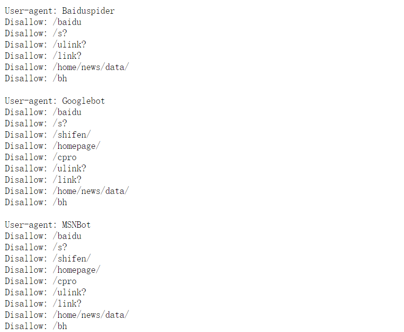
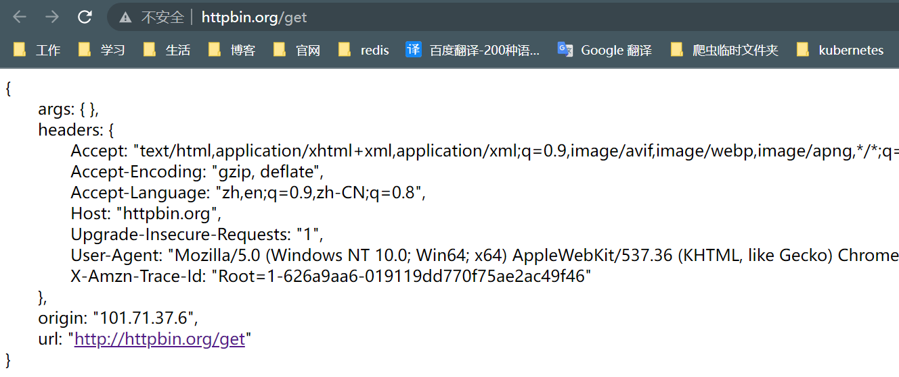
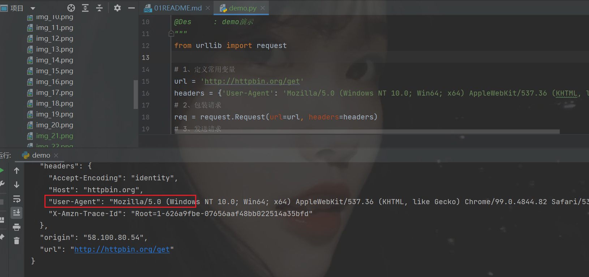

# 网络爬虫概述

**什么是网络爬虫**

网络蜘蛛、网络机器人、抓取网络数据的程序

其实就是用python程序模仿人点击浏览器并访问网站，而且模仿的越逼真越好


**爬虫有风险，代码需谨慎！**

[爬虫被请去喝茶的实例](https://www.cnblogs.com/ityouknow/p/11684770.html)

**爬虫的目的**

1、获取大量数据，用来做数据分析

2、作为公司项目的测试数据

3、公司业务所需数据

**企业获取数据的方式**

1、公司自有数据（大厂居多）

2、第三方数据平台购买（数据堂、贵阳大数据交易所）

3、爬虫爬取数据 

**爬虫语言**

python：请求、解析模块丰富成熟，强大的scrapy网络爬虫框架

PHP：对多线程、异步支持不太好（主要是网络IO的负载）

Java：代码笨重、代码量大

c/c++：虽然执行效率高，但是代码成型慢

**网络爬虫的分类**

1、通用网络爬虫（搜索引擎使用，遵循robots协议）

[robots协议](https://www.baidu.com/robots.txt)：网站通过robots协议告诉搜索引擎那些页面可以抓取，哪些页面不可以抓取，通用网络爬虫需要遵守robots协议。



2、聚焦网络爬虫：自己写的爬虫程序

**爬取数据步骤**

1、确定需要爬取的URL地址

2、由请求模块向URL地址发出请求，并得到网站的响应

3、利用解析模块从响应内容中提出所需数据

4、所需要的数据进行保存
 
5、页面中有其他需要继续跟进二级或者多级的URL地址，则继续第二步去发送请求，如从循环。
  
# urllib.request原理和使用

**urllib.request**

为Python标准库模块

**程序导入方式**
```text
import urllib.request

from urllib import request

作用： 向网站发起请求 即：我们平时在浏览器输入地址访问网站一样
```


**urllib.request.urlopen()方法**
```text
urlopen()
作用： 向网站发起请求并获取响应对象

参数：
URL 需要爬取的URL地址
timeout：设置等待超时时间，指定时间内未响应抛出超时异常
```

**响应对象的方法**
```text
res.read() - 获取响应内容（字节串）
res.read().decode() - 获取响应内容（字符串）
res.geturl() - 返回实际数据的URL地址
res.getcode() - 获取HTTP响应码
```

**Demo**
```python
#!/usr/bin/python3
# -*- coding: utf-8 -*-
"""
@FileName: demo.py
@Time    : 2022/4/28 21:39
@Author  : 热气球
@Software: PyCharm
@Version : 1.0
@Contact : 2573514647@qq.com
@Des     : Demo演示
"""
from urllib import request

res = request.urlopen(url='https://www.baidu.com/')
# 响应对象方法1：read() -> bytes
html = res.read().decode()
print(html)
# 响应方法2： geturl() -> 返回实际数据的URL地址
url = res.geturl()
print(url)
# 响应对象方法3：getcode() -> 返回HTTP响应码
code = res.getcode()
print(code)
```

**网站如何判断是人类行为还是程序行为**

请求头中的User-Agent

[测试发送请求时的headers到底是什么](http://httpbin.org/get)



**Demo**
```python
#!/usr/bin/python3
# -*- coding: utf-8 -*-
"""
@FileName: demo.py
@Time    : 2022/4/28 21:39
@Author  : 热气球
@Software: PyCharm
@Version : 1.0
@Contact : 2573514647@qq.com
@Des     : demo演示
"""
from urllib import request

res = request.urlopen(url='http://httpbin.org/get')
html = res.read().decode()
print(html)
```


**urllib.request.Request()方法**
```text
使用流程
    创建请求对象
    包装请求，重构User-Agent,使程序更像人类请求
常用参数
    URL：请求URL地址
    headers：添加请求头，类型为字典headers = {'User-Agent': ''}
使用示例
    from urllib import request
    -- 构造请求对象 req = request.Request(url=url,headers=headers)
    -- 获取响应对象 res = request.urlopen(req)
    -- 构造响应内容 html = res.read().decode()
```
**Demo**
```python
#!/usr/bin/python3
# -*- coding: utf-8 -*-
"""
@FileName: demo.py
@Time    : 2022/4/28 21:39
@Author  : 热气球
@Software: PyCharm
@Version : 1.0
@Contact : 2573514647@qq.com
@Des     : demo演示
"""
from urllib import request

# 1、定义常用变量
url = 'http://httpbin.org/get'
headers = {'User-Agent': 'Mozilla/5.0 (Windows NT 10.0; Win64; x64) AppleWebKit/537.36 (KHTML, like Gecko) Chrome/99.0.4844.82 Safari/537.36'}
# 2、包装请求
req = request.Request(url=url, headers=headers)
# 3、发送请求
res = request.urlopen(req)
# 4、获取响应内容
html = res.read().decode()
print(html)
```


**小结**
```text
网站反爬第一步：检查请求头中的User-Agent
请求网站三步走：
    -- 构造请求对象
    -- 获取响应内容
    -- 提取响应对象内容
```
# urllib.parse编码模块


# 正则表达式模块使用


