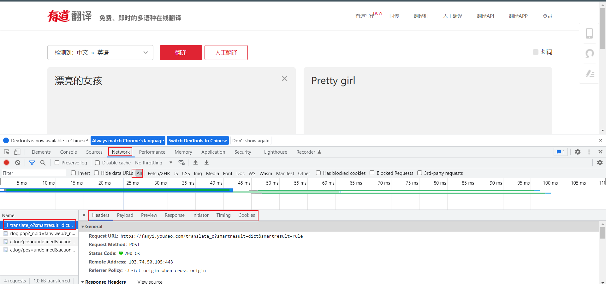
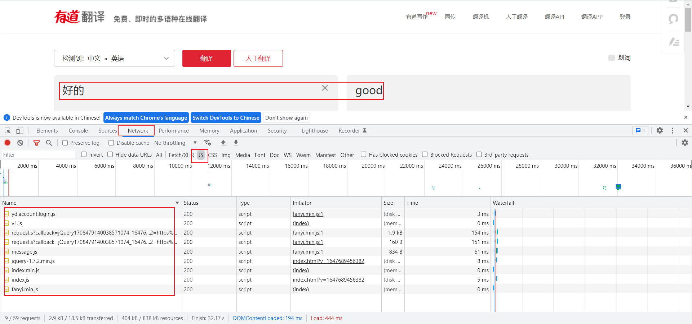
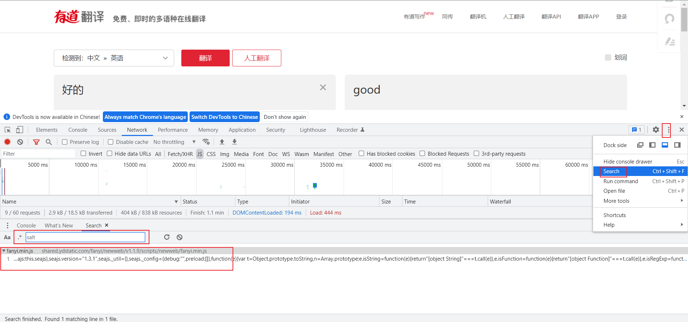
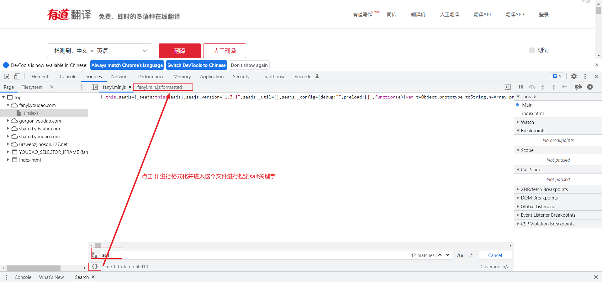
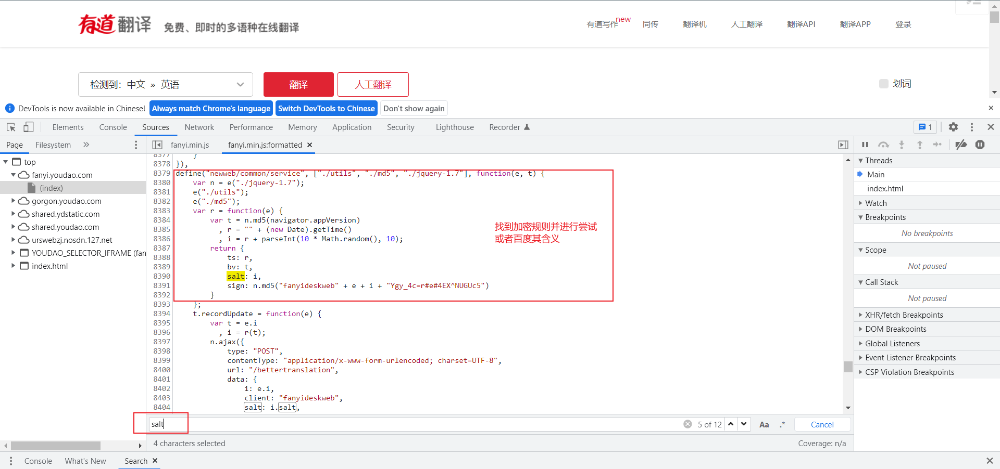
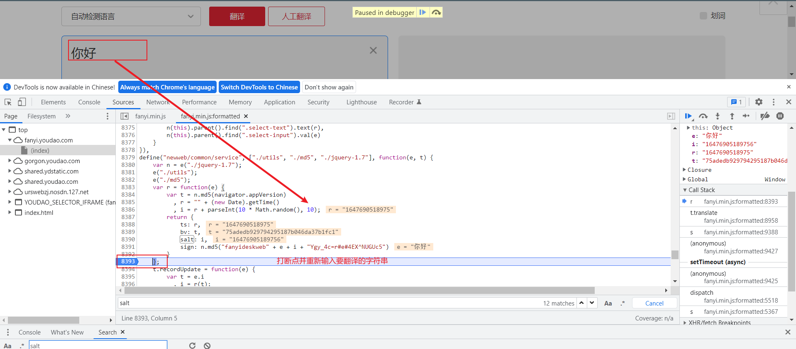

# requests的高级使用

### 代理IP的使用


```text
代理IP定义：代替你原来的IP地址去对接网络的IP地址
作用：隐藏自身真是IP，避免被目标网站封掉。

代理IP分类：
高匿代理：web端只能看到代理IP
普通代理：web端知道有人通过此代理IP访问，但不知道用户真是IP
透明代理：web端能看到用户真实IP，也能看到代理IP

应用场景：
针对高频率访问的IP地址进行了反爬机制，封掉IP地址的网站

代理IP地址：自行百度代理IP
```


语法格式
```python
        proxies = {
            'http': 'http://IP:端口号',
            'https': 'http://IP:端口号'
        }
       res = requests.get(url=self.test_url, proxies=proxies, headers=self.headers, timeout=2)
```

**示例**
```python
#!/usr/bin/python3
# -*- coding: utf-8 -*-
"""
@FileName: ProxyIpPool.py
@Time    : 2022/3/14 8:53
@Author  : 热气球
@Software: PyCharm
@Version : 1.0
@Contact : 17695691664@163.com
@Des     : 抓取飞度代理的免费高匿代理并测试可用性
"""

import requests
import re
from fake_useragent import UserAgent


class ProxyPool:
    def __init__(self):
        self.proxy_url = 'http://www.feidudaili.com/index/gratis/index?page={}'
        self.test_url = 'https://www.baidu.com/'
        self.headers = {'User-Agent': UserAgent().random}
        self.ip_list = []

    def get_proxy_pool(self, url):
        try:
            html = requests.get(url=url, headers=self.headers, timeout=3).text
            self.parse_html(html=html)
        except Exception as e:
            print('页面响应超时，重试中。。。。。。')

    def parse_html(self, html):
        regex = '<tr>.*?<td>(.*?)</td>.*?<td>(.*?)</td>.*?<td>.*?</td>.*?</td>.*?</tr>'
        pattern = re.compile(regex, re.S)
        r_list = pattern.findall(html)
        try:
            for li in r_list:
                host = li[0]
                port = li[1]
                ipaddress = host + ':' + port
                self.test_proxy(proxy=ipaddress)
        except IndexError as e:
            print(e)

    def test_proxy(self, proxy):
        """ 测试一个代理IP地址是否可用 """
        proxies = {
            'http': 'http://{}'.format(proxy),
            'https': 'http://{}'.format(proxy)
        }
        try:
            res = requests.get(url=self.test_url, proxies=proxies, headers=self.headers, timeout=2)
            if res.status_code == 200:
                print(proxy, '\033[32m可用\033[0m')
                html = requests.get(url='http://httpbin.org/get', headers=self.headers, proxies=proxies, timeout=3).text
                print('html:', html)
                self.ip_list.append(proxy)
        except Exception as e:
            print(proxy, '\033[31m不可用\033[0m')

    def run(self):
        for pg in range(1, 4504):
            url = self.proxy_url.format(pg)
            self.get_proxy_pool(url=url)


if __name__ == '__main__':
    spider = ProxyPool()
    spider.run()
    print('可用的代理列表为：', spider.ip_list)
```

效果展示


### requests.post()方法


```text
适用场景:
post类型请求的网站

参数说明:
参数名为data,类型为字典
res = requests.post(url=url,data=data,headers=headers)

post请求特点:
以Form表单进行提交数据
```


**使用浏览器分析数据**



```text
①F12 点击network

②选择ALL 查看所有的网络数据包

③选择网络数据包

④选择要查看的信息

解释:
ALL:所有的网络数据包
XHR:异步加载的网络数据包
JS:加载的JS文件信息
...
Headers:请求头信息
Preview:预览信息
Response:响应的内容
```


**post方式请求有道翻译并获取翻译内容**


**实现逻辑:post向url发起请求并携带From表单,获取到HTML信息,并从中提取出翻译的内容.**

**难点: 破解反爬的验证,涉及到js加密**


```text
salt: 16476853549203
sign: d3b8cfa182556ac326e8475567b58d7c
lts: 1647685354920
bv: 75adedb929794295187b046da37b1fc1

经过翻译多个单词找到规律
bv不变 salt\sign\lts会变化

```

下一步就是找到加密的规则,猜测是js加密,那么就观察js进行验证



搜索加密的字符










获取到加密方式后进行实现


**小技巧快速生成字典**


**示例**
```python
#!/usr/bin/python3
# -*- coding: utf-8 -*-
"""
@FileName: PostYoudaoTranslate.py
@Time    : 2022/3/19 20:11
@Author  : 热气球
@Software: PyCharm
@Version : 1.0
@Contact : 17695691664@163.com
@Des     : 有道翻译结果抓取
"""
import requests
import time
import random
from hashlib import md5


class PostYoudaoTranslate:
	def __init__(self):
		# post_url:浏览器F12抓取到的POST地址
		self.post_url = 'https://fanyi.youdao.com/translate_o?smartresult=dict&smartresult=rule'
		self.headers = {
			'Accept': 'application/json, text/javascript, */*; q=0.01',
			'Accept-Encoding': 'gzip, deflate, br',
			'Accept-Language': 'zh-CN,zh;q=0.9',
			'Connection': 'keep-alive',
			'Content-Length': '252',
			'Content-Type': 'application/x-www-form-urlencoded; charset=UTF-8',
			'Cookie': 'OUTFOX_SEARCH_USER_ID=-2011095651@10.110.96.157; JSESSIONID=aaa3D7ZIRV27NfAOoPH_x; OUTFOX_SEARCH_USER_ID_NCOO=859081232.0887973; fanyi-ad-id=305110; fanyi-ad-closed=1; ___rl__test__cookies=1647690518973',
			'Host': 'fanyi.youdao.com',
			'Origin': 'https://fanyi.youdao.com',
			'Referer': 'https://fanyi.youdao.com/',
			'sec-ch-ua': '" Not A;Brand";v="99", "Chromium";v="98", "Google Chrome";v="98"',
			'sec-ch-ua-mobile': '?0',
			'sec-ch-ua-platform': '"Windows"',
			'Sec-Fetch-Dest': 'empty',
			'Sec-Fetch-Mode': 'cors',
			'Sec-Fetch-Site': 'same-origin',
			'User-Agent': 'Mozilla/5.0 (Windows NT 10.0; Win64; x64) AppleWebKit/537.36 (KHTML, like Gecko) Chrome/98.0.4758.82 Safari/537.36',
			'X-Requested-With': 'XMLHttpRequest',
		}
	
	def md5_string(self, string):
		""" 功能函数:对字符串进行md5的加密 """
		s = md5()
		s.update(string.encode())
		
		return s.hexdigest()
	
	def get_ts_salt_sign(self, word):
		""" 获取ts salt sign """
		ts = str(int(time.time() * 1000))
		salt = ts + str(random.randint(0, 9))
		string = "fanyideskweb" + word + salt + "Ygy_4c=r#e#4EX^NUGUc5"
		sign = self.md5_string(string)
		
		return ts, salt, sign
	
	def attack_yd(self, word):
		ts, salt, sign = self.get_ts_salt_sign(word)
		data = {
			'i': word,
			'from': 'AUTO',
			'to': 'AUTO',
			'smartresult': 'dict',
			'client': 'fanyideskweb',
			'salt': salt,
			'sign': sign,
			'lts': ts,
			'bv': '75adedb929794295187b046da37b1fc1',
			'doctype': 'json',
			'version': '2.1',
			'keyfrom': 'fanyi.web',
			'action': 'FY_BY_REALTlME'
		}
		# .json():作用是把一个json格式的字符串转为python数据类型
		html = requests.post(url=self.post_url, data=data, headers=self.headers).json()
		print(html['translateResult'][0][0]['tgt'])
	
	def run(self):
		word = input('请输入要翻译的单词:')
		self.attack_yd(word)


if __name__ == '__main__':
	spider = PostYoudaoTranslate()
	spider.run()

```


**效果展示**


