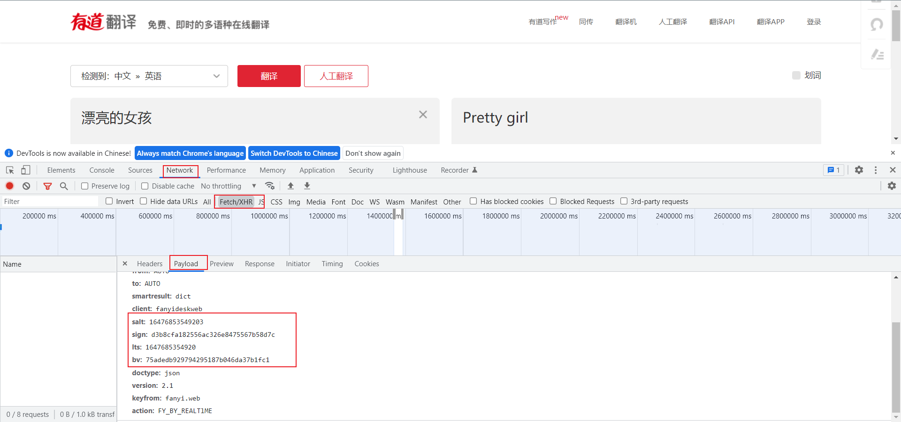
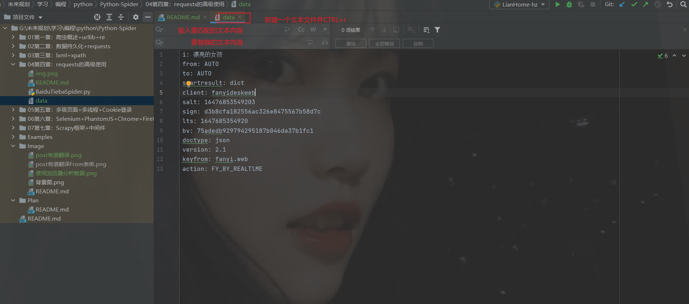
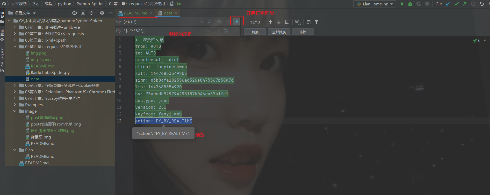
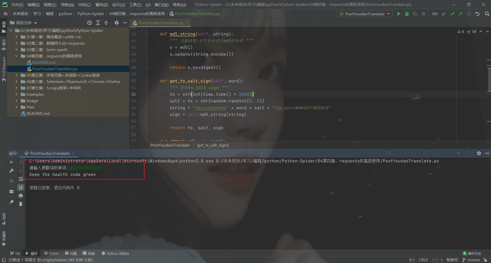

# requests的高级使用

### 代理IP的使用

### requests.post()方法

**适用场景**

post类型请求的网站

**参数说明**

参数名为data,类型为字典

res = requests.post(url=url,data=data,headers=headers)

**post请求特点**

以Form表单进行提交数据

**使用浏览器分析数据**

①F12 点击network

②选择ALL 查看所有的网络数据包

③选择网络数据包

④选择要查看的信息

**解释:**

ALL:所有的网络数据包

XHR:异步加载的网络数据包

JS:加载的JS文件信息

...

Headers:请求头信息

Preview:预览信息

Response:响应的内容

**post方式请求有道翻译并获取翻译内容**

**实现逻辑:post向url发起请求并携带From表单,获取到HTML信息,并从中提取出翻译的内容.**

**难点: 破解反爬的验证,涉及到js加密**

salt: 16476853549203

sign: d3b8cfa182556ac326e8475567b58d7c

lts: 1647685354920

bv: 75adedb929794295187b046da37b1fc1

经过翻译多个单词找到规律

bv不变 salt\sign\lts会变化

下一步就是找到加密的规则,猜测是js加密,那么就观察js进行验证

搜索加密的字符

获取到加密方式后进行实现

小技巧快速生成字典

代码[PostYoudaoTranslate.py]

**效果展示**

